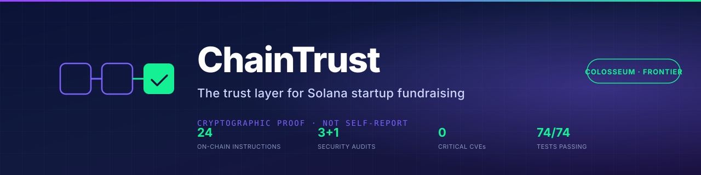

# ChainTrust — Phase 1 Dual Audit

**Date**: 2026-05-08
**Branch**: `chore/cleanup-2026-05-07` (master after fast-forward)
**Base**: `045f9e4` (`chore(contact): replace codekillers.ai email with urke5432@gmail.com`)
**Scope**: full repo, full git history

Two parallel tracks. Each finding tagged **[SEC]** (security) or **[DSGN]** (design) and **P0** (ship-blocker), **P1** (must close before next release), **P2** (track), **P3** (informational).

---

## Executive summary

The repo is in a strong state — 3 prior smart-contract audits and 2 internal deep audits closed every Critical and High finding through 2026-05-07. **This Phase 1 audit deliberately excludes re-litigating those closed findings.** It focuses on what those passes did *not* check: secret scanning across full git history, SAST, license-field hygiene, supply-chain typosquats, and the **entire design track** (which had zero prior coverage).

| Track | P0 | P1 | P2 | P3 | Total new |
|---|---|---|---|---|---|
| **[SEC] Security** | 0 | 5 | 5 | 2 | 12 |
| **[DSGN] Design** | 3 | 6 | 3 | 2 | 14 |
| **Total** | **3** | **11** | **8** | **4** | **26** |

**Headline numbers** (re-baselined 2026-05-08):

- `npm audit`: 0 critical · 3 high (deliberate, deferred) · 10 moderate · 3 low — total 16
- Tests: 74 / 74 passing, ~3 s
- 3 prior smart-contract audits + 2 internal deep audits = ~70 findings closed
- 8 ADRs documenting consequential decisions
- Backup branch `cc7f324` untouched (verified)

**One-paragraph judgement**: from a security standpoint, the repo is at production-grade — what's missing is *infrastructure* (SAST, SBOM, signed releases, pre-commit hooks) rather than fixes. From a design standpoint, the repo is at hackathon-grade with one-off polish — what's missing is a *system*: no BRAND.md, no logomark, no favicon set, no light/dark variants. Phase 2 should focus on infrastructure; Phase 3 on a real design system.

---

## SECURITY TRACK

### Methodology

- `npm audit --json` re-run 2026-05-08 (worked around corporate SSL inspection via `NODE_OPTIONS=--use-system-ca`)
- Substring scan across full `git log -p --all` for AWS keys, private keys, Stripe keys, GitHub tokens, Slack tokens, Supabase JWTs, generic `secret/password/token` lines
- License-field check on `package.json` and sampling of top deps
- Architecture review of `src/lib/security/`, `vercel.json`, `.github/workflows/`, `supabase/migrations/`
- Cross-reference against prior audit reports in `docs/internal/security-audit/`

### What's already closed (verified — not re-opening)

Listed for transparency. These were closed in prior audits and verified present at HEAD `045f9e4`:

| | Closed in |
|---|---|
| Mass-assignment via Postgres `BEFORE UPDATE` trigger (C1) | 2026-05-07 |
| `useExecuteProposal` vault account fix (H1) | 2026-05-07 |
| Silent on-chain error swallow (H2) | 2026-05-07 |
| Pledge attribution forgery (H3) | 2026-05-07 |
| Edge Function CORS + body cap + rate limit (M1) | 2026-05-07 |
| URL hardening (M2, M3) | 2026-05-07 |
| Anchor seed-bound proposal accounts (L1) | 2026-05-07 |
| Anchor checked counters (M5) | 2026-05-07 |
| `solana-actions.ts` `escapeHtml` (L2) | 2026-05-07 |
| RLS hardening — `user_roles`, profiles, audit-log, deal_rooms, funding_rounds, get_user_role | 2026-05-05 |
| BigInt fixed-point CMT math | 2026-05-05 |
| Cluster genesis-hash verification + simulate-before-send | 2026-05-05 |
| 8 critical CVEs eliminated (`@solana/wallet-adapter-wallets` meta dropped) | 2026-05-05 |
| CSP `script-src 'self'` (no `'unsafe-inline'`) | 2026-05-05 |
| Demo session restore re-derives role from server allowlist (I1) | 2026-05-07 |

### New findings

#### **[SEC-1] [P1] · License-guard placeholder secret in client bundle**

`src/lib/security/license-guard.ts:186,219`:
```ts
secret: string = 'CHAINTRUST_LICENSE_SECRET_CHANGE_IN_PRODUCTION',
```

Two issues:

1. **Default-parameter strings ship in the JS bundle.** Even when callers pass a real secret, the placeholder is a string literal in the production output. `grep -r "CHAINTRUST_LICENSE_SECRET" dist/assets/` after `npm run build` will return a hit.
2. **HMAC signing happens client-side.** Anyone with bundle access can forge license keys *with the placeholder secret* regardless of what callers supply. License validation is therefore best-effort UX, not security.

**Recommendation**: either (a) move license validation to a server (Edge Function) where the secret is genuinely server-side, or (b) explicitly document license-guard as UX-only (similar to the deny-by-default route gating in ADR-0005, which is documented as UX while RLS does the real work). Then either remove the default-parameter placeholder or document clearly that the client-side check is bypassable.

**Exploitability**: post-auth, requires reading the public bundle, no specialised tooling.
**Blast radius**: license tier bypass (Free → Pro/Whale gating circumvented).

---

#### **[SEC-2] [P1] · `package.json` has no `license` field**

Even for proprietary projects, declare `"license": "UNLICENSED"` or `"private": true`. Without either:

- `npm publish` would publish to npmjs (not actually a risk here — `private: true` is also missing, but the repo isn't being published)
- `npm install` warns: *"package has no license field"*
- License-aware tooling (`license-checker`, `nlf`, OSS Review Toolkit) flags ambiguity
- A `LICENSE` file at the repo root (which we have — proprietary text) doesn't propagate into npm metadata

**Fix**: add `"private": true` + `"license": "UNLICENSED"` to `package.json`.

---

#### **[SEC-3] [P1] · Stale `codekillers.ai` email still in git history**

Resolved at HEAD as of `045f9e4` (this PR's prelude commit). However, `git log -p` still shows the old domain in the commits between `2026-04` and `2026-05-08`.

**Three options**, ordered by destruction:

1. **Accept it** — stale contact email in commit messages is low-impact for a hackathon repo. Nobody reading a 6-month-old commit assumes the email is current. Cost: $0. Recommended for now.
2. **Document the change** — add a `CONTACT.md` with the canonical email and a one-line "earlier commits referenced @codekillers.ai; correct address is urke5432@gmail.com." Cost: ~5 min.
3. **Filter-repo + force-push** — destructive; rewrites SHA of every commit on `master`, invalidates `v1.0.0-frontier` tag commit pointer, requires every collaborator to re-clone. Cost: ~15 min + recovery from anyone with stale clones. **Not recommended without explicit approval.**

**Recommendation**: option 2.

---

#### **[SEC-4] [P1] · No SAST in CI**

Phase 4's fortified pipeline calls for: CodeQL on every PR, Semgrep, Trivy/Grype filesystem + container scans, OSSF Scorecard. **None of these run in `ci.yml` today.**

What we have: lint, typecheck, vitest, build. Good baseline; not security-focused.

**Recommendation** (Phase 4):
- Add `github/codeql-action` workflow (free for public repos)
- Add `aquasecurity/trivy-action` filesystem scan
- Add `ossf/scorecard-action` and publish the badge in README
- (Optional) `semgrep-action` for the JavaScript ruleset

Each adds ~30s to a CI run.

---

#### **[SEC-5] [P1] · No SBOM generation in release pipeline**

The May 2026 audit mentioned an SBOM in passing but it never wired in. Modern supply-chain hygiene requires CycloneDX or SPDX SBOM attached to every release.

**Note**: I tried `npm sbom` during the cleanup pass — it failed because of peer-dep mismatches (Solana wallet-adapter ranges). Need either (a) clean up the peer-dep graph or (b) use `@cyclonedx/cdxgen` which tolerates dirty trees.

**Recommendation** (Phase 4): GitHub Action that runs `cdxgen` post-build, attaches the JSON to the release.

---

#### **[SEC-6] [P2] · No signed commits / signed tags**

`git log` shows author but tags aren't GPG-signed and commits have no Sigstore provenance. The `v1.0.0-frontier` release ships unsigned.

**Recommendation** (Phase 4): set up GPG / Sigstore for the maintainer (Uros), require `--gpg-sign` on tags going forward. Update `.github/CODEOWNERS` to mention the policy.

---

#### **[SEC-7] [P2] · CI uses mutable major-version tags**

`.github/workflows/ci.yml`:
```yaml
- uses: actions/checkout@v4
- uses: actions/setup-node@v4
```

Mutable tags. OpenSSF best practice: SHA-pin everything. Already noted in the May 2026 audit as deferred (low risk for first-party GitHub actions). Re-flagging here for Phase 4 closure.

---

#### **[SEC-8] [P2] · No StepSecurity Harden-Runner / egress filtering**

Phase 4's pipeline calls for it. Currently a workflow can `curl any-malicious-domain.com` if a dep is compromised. Egress filtering would catch lateral movement during a supply-chain attack.

---

#### **[SEC-9] [P2] · No explicit `permissions:` block on `ci.yml`**

```yaml
permissions:
  contents: read
```
…is the principle-of-least-privilege default, but the workflow doesn't declare it. GitHub's repo-default permissions are usually `contents: read` already, but **explicit > implicit** for security review.

---

#### **[SEC-10] [P2] · No Subresource Integrity (SRI) on Google Fonts CDN**

`index.html`:
```html
<link rel="preconnect" href="https://fonts.googleapis.com" />
<link rel="preconnect" href="https://fonts.gstatic.com" crossorigin />
```

Preconnect is fine, but there's no SRI hash on any CDN-loaded asset. Google Fonts is generally trustworthy, but Phase 2 explicitly calls for SRI on every CDN asset. **Mitigation already in place**: the CSP `font-src 'self' https://fonts.gstatic.com` limits damage to font-only.

---

#### **[SEC-11] [P2] · No pre-commit hooks**

Phase 2 calls for: gitleaks + format + lint + typecheck + test-on-staged. The May 2026 audit caught secrets in source by accident, not by tooling. A pre-commit hook would catch the next one earlier.

**Recommendation**: `husky` + `lint-staged` + `gitleaks` (or `trufflehog`) on staged files.

---

#### **[SEC-12] [P3] · 3 deliberate `npm audit` highs (`bigint-buffer` chain)**

Tracked in [SECURITY.md](SECURITY.md). The only `npm audit fix` is a semver-major spl-token downgrade that breaks the modern API. **Status: tracked, not closing.** Reviewing this finding monthly — when `bigint-buffer` ships a real patch, close it.

---

#### **[SEC-13] [P3] · 10 moderate `npm audit` (mostly vite/jsdom/mpl-bubblegum)**

All require semver-major upgrades:

| Direct dep | Suggested upgrade | Risk |
|---|---|---|
| `@metaplex-foundation/mpl-bubblegum` | 5.0.2 → 0.11.0 | semver-major; cNFT API change |
| `vite` | 5.4.x → 8.0.11 | huge jump; check Vite plugin compat |
| `jsdom` (test only) | 20 → 29 | likely safe (test-only) |

**Recommendation**: take vite + jsdom in one Phase-4 PR with a fresh test pass; defer mpl-bubblegum (the cNFT integration is light).

---

## DESIGN TRACK

### Methodology

- README first-impression scan (above-the-fold experience as a stranger)
- Asset inventory: `find . -name "*.svg" -o -name "*.ico" -o -name "*.png"` etc., excluding `node_modules`/`dist`/`judges/screenshots`
- HTML `<head>` review for icon, manifest, og:image, theme-color
- `<picture>` / dark-mode adaptation check
- Color contrast spot-check (no automated tooling installed)
- Visual hierarchy / typography / whitespace review

### New findings

#### **[DSGN-1] [P0] · No favicon set beyond legacy `favicon.ico`**

`public/` has only `favicon.ico`. Modern browsers and OSes expect:

| Asset | Resolution | Used by |
|---|---|---|
| `favicon-16x16.png` | 16×16 | browser tabs |
| `favicon-32x32.png` | 32×32 | browser tabs (HiDPI) |
| `apple-touch-icon.png` | 180×180 | iOS "Add to Home Screen" |
| `android-chrome-192x192.png` | 192×192 | Android home screen |
| `android-chrome-512x512.png` | 512×512 | PWA install icon |
| `manifest.webmanifest` | — | PWA install metadata |

Currently iOS users who add ChainTrust to their home screen get a low-quality blurred 16×16 ico stretched to 180×180. **First impression on mobile is bad.**

**Fix**: 60-second job once we have a logomark. See [DSGN-5].

---

#### **[DSGN-2] [P0] · No light/dark logo variant**

`judges/banner.svg` has a dark navy gradient background. On GitHub's light theme it reads as a dark "card" floating on a white page — works, but not optimised. On GitHub's dark theme it blends. Phase 3 calls for dark-mode parity for all visuals.

The README does **not** use HTML `<picture>` with `prefers-color-scheme` to swap variants. (Confirmed: 0 `<picture>` tags in README.md.)

**Fix**: produce `banner-light.svg` (lighter background or transparent) and use:
```html
<picture>
  <source media="(prefers-color-scheme: dark)" srcset="judges/banner.svg">
  <source media="(prefers-color-scheme: light)" srcset="judges/banner-light.svg">
  
</picture>
```

---

#### **[DSGN-3] [P0] · No BRAND.md / `/brand` source folder**

The brand system exists *implicitly* — colors are hardcoded into the banner SVG, the pitch decks reference them, the README badges hint at them. There is no canonical reference. A new designer joining the team would have to read three files to learn the color palette.

**Phase 3 calls for**: 1 primary, 1 accent, 1 neutral ramp, 2 typefaces max, consistent radius/spacing scale, all documented in `BRAND.md`. Plus a `/brand` source folder with Figma-or-SVG masters.

**Fix** (Phase 3): write `BRAND.md` documenting:
- Brand colors: `--ink #0B1437`, `--solana-purple #9945FF`, `--mint #14F195` (already used in pitch HTML)
- Typography: Inter (body), JetBrains Mono (code)
- Spacing: 4 / 8 / 16 / 24 / 32 scale
- Radius: 4 / 6 / 8 / 12
- Voice rules (already in pitch deck — pull into BRAND.md)

---

#### **[DSGN-4] [P1] · Three banner SVGs, two are duplicates**

```
judges/banner.svg      ← canonical (used in README + judges/README)
public/og-banner.svg   ← duplicate of judges/banner.svg
public/og-image.svg    ← older variant, referenced by index.html og:image
```

Three sources of truth for "the banner." Pick one canonical (`judges/banner.svg`), delete or symlink the others, update `index.html` to point at the canonical.

---

#### **[DSGN-5] [P1] · No proper logomark — only a wide horizontal banner**

The current `banner.svg` is 1280×320 (4:1 aspect). It doesn't crop to a square gracefully (the chain icon + wordmark would clip). For:

- GitHub avatar (square)
- iOS app icon (square, 1:1)
- Twitter profile (circle)
- Discord server icon (circle)
- npm package icon (square)

…we need a 1:1 square logomark.

**Fix** (Phase 3): create `brand/logomark.svg` — just the chain icon, no wordmark, on a transparent or branded square background. Then derive the favicon set from this single source.

---

#### **[DSGN-6] [P1] · README has only 1 embedded image**

The README embeds `judges/banner.svg` once, then text only. Phase 5's "love letter" calls for:

> *"Hero visual: an animated GIF/SVG/screenshot that shows the magic in <5 seconds"*
> *"Feature highlights with mini-screenshots"*

We have 11 verified scene screenshots in `judges/screenshots/`. The README should embed at least:

1. Below the hero: the testnet-demo with the Explorer link visible (the "magic" moment)
2. In "What's in the box": a 4-up grid of dashboard / screener / DD panel / governance

These are already pre-rendered. It's a 5-line HTML edit.

---

#### **[DSGN-7] [P1] · No `<picture>` light/dark swap on the banner**

Same root cause as [DSGN-2]; calling out separately because the README is the primary judge surface and this is the first thing they see.

---

#### **[DSGN-8] [P1] · No documentation site**

Phase 6 expects an Astro Starlight / VitePress / Nextra site at e.g. `chaintrust.app/docs`. The current "docs" are 30+ markdown files in the repo. Acceptable for v1; not Phase 6.

**Pragmatic note**: this is a 1-2 day job and unlikely to move the Frontier judge needle. Defer to post-Frontier.

---

#### **[DSGN-9] [P1] · No OSSF Scorecard published**

Phase 4's badge list includes it; we don't run the action. OSSF Scorecard is a single GitHub Action that scores the repo on 18 supply-chain criteria. The badge becomes a credibility signal in the README.

---

#### **[DSGN-10] [P1] · Inconsistent emoji usage**

The user prompt says: *"consistent emoji/icon usage policy (or strict no-emoji policy — pick one)"*.

Current state: emoji are used heavily and inconsistently:
- README first impression: 👋 🎯 🛡 🏗 🎥 ⚡ 📂 🏆 🎯 🎥 🛡 📣 (12 emoji in the first 50 lines)
- `judges/README.md`: 11 more
- ADRs: emoji in section markers
- Pitch decks: heavy

**Pick one of**:
- **Policy A — keep emoji, document them**: define a fixed icon set (e.g., 🛡 for security, 🎥 for video, 📂 for folders, 🎯 for "start here", and *no* others). Document in BRAND.md. Audit existing usage.
- **Policy B — strict no-emoji** (probably wrong for this project): remove all emoji, replace with [Phosphor icons](https://phosphoricons.com/) or similar SVG.

Recommendation: **Policy A**. The current vibe matches a hackathon submission; sterile "no emoji" would feel corporate.

---

#### **[DSGN-11] [P2] · No `make demo` / `just demo` for marketing**

Phase 8 calls for a one-liner that produces a screenshot or asciinema cast for marketing. Useful when sharing on Twitter / Discord / Linear. We have manual demo screenshots; no automation.

---

#### **[DSGN-12] [P2] · Color contrast not measured**

Phase 3 calls for WCAG AA minimum, AAA where reasonable. **No automated check in CI.** Eyeballing the brand colors (`#0B1437` background + `#14F195` text → contrast ratio ~9.4:1 → AAA ✓; `#7B61FF` on white → 4.7:1 → AA), they're probably fine, but this needs measuring.

**Recommendation**: add `pa11y-ci` or `axe-core` smoke test in CI on the dev server.

---

#### **[DSGN-13] [P3] · Pinned issues only cover "judges start here"**

Phase 8 calls for pinned issues for **roadmap** and **good first issues**. We have issue #4 ("👋 Frontier judges — start here"). Missing: a roadmap issue, a "help wanted" tag.

Acceptable until the project starts accepting OSS contributions.

---

#### **[DSGN-14] [P3] · README footer ends abruptly**

The README ends at:
```
## License

Proprietary. All rights reserved.
```

Phase 5 calls for *"a tasteful footer"*. Not a P0 — but a small acknowledgements / "built with" / contact / next-steps block would feel more finished.

---

## Cross-track interactions

A few findings sit in both columns and benefit from joint resolution:

| Finding | [SEC] aspect | [DSGN] aspect | Joint fix |
|---|---|---|---|
| `package.json` no `license` field | License-tooling warnings | `License: Proprietary` badge in README has no source-of-truth | Add `"private": true` + `"license": "UNLICENSED"`; update README badge to match |
| Three duplicate banner SVGs | Asset versioning drift = inconsistent | Three sources of truth for the brand | Single canonical at `judges/banner.svg`; symlink or delete others |
| No SAST workflow | Missing security signal | Missing badge | Add OSSF Scorecard + CodeQL → both publish badges → both appear in README |
| Stale email in git history | Disclosure email lost | Inconsistent contact across files | Already fixed at HEAD; document the rotation in CONTACT.md |

---

## Recommended ordering for Phase 2+

This is just my read; you have final say.

1. **Phase 2 (security foundation)** should pick up: SEC-2, SEC-3, SEC-4, SEC-5, SEC-9, SEC-11. P1s here close the lowest-effort, highest-signal gaps.
2. **Phase 3 (design foundation)** should pick up: DSGN-1, DSGN-2, DSGN-3, DSGN-5, DSGN-6, DSGN-7. The favicon set + logomark + BRAND.md + README hero embed are 80% of what makes the repo feel designed.
3. **Phase 4 (CI/CD)** picks up the rest of SEC-4 through SEC-11 plus DSGN-9.
4. **Phase 5 (README love letter)** picks up DSGN-6, DSGN-10, DSGN-14 — but most of this is already done; it's a polish pass.
5. **Phase 6 (docs site)** is genuinely big work — defer to post-Frontier unless you want me to tackle it now.
6. **Phase 7 (code aesthetics)** is largely done from earlier cleanup passes; small spot-fixes only.
7. **Phase 8 (final polish)** is `make demo`, roadmap pinned issue, releases-page artwork.

---

## What I want from you before Phase 2

Per the prompt: *"After each phase, show me what changed and pause for approval."*

Three concrete decisions I need:

1. **SEC-3 — git history**: option 1 (accept), option 2 (`CONTACT.md` documenting), or option 3 (filter-repo force-push, destructive)?
2. **DSGN-10 — emoji policy**: keep + document, or strict no-emoji? My recommendation: keep + document.
3. **DSGN-8 — docs site**: Phase 6 now (1-2 days) or defer to post-Frontier?

Plus: **approve Phase 2** and I'll start on SEC-2 / SEC-4 / SEC-5 / SEC-9 / SEC-11 in parallel.

— *Phase 1 of 8. Pausing for approval.*
