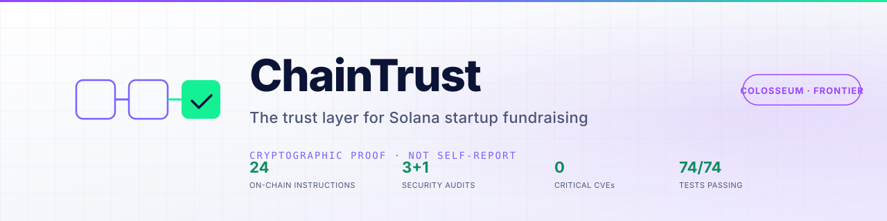
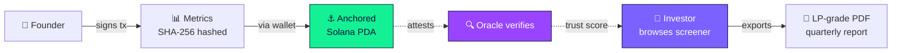
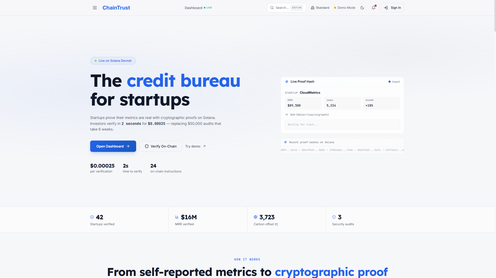
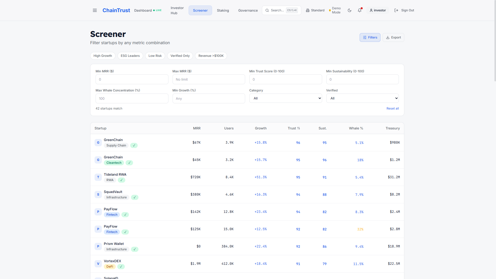
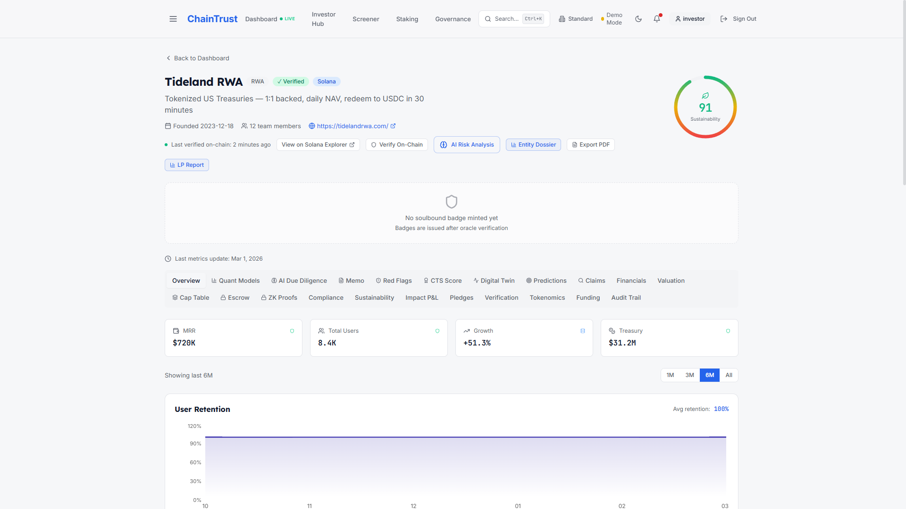
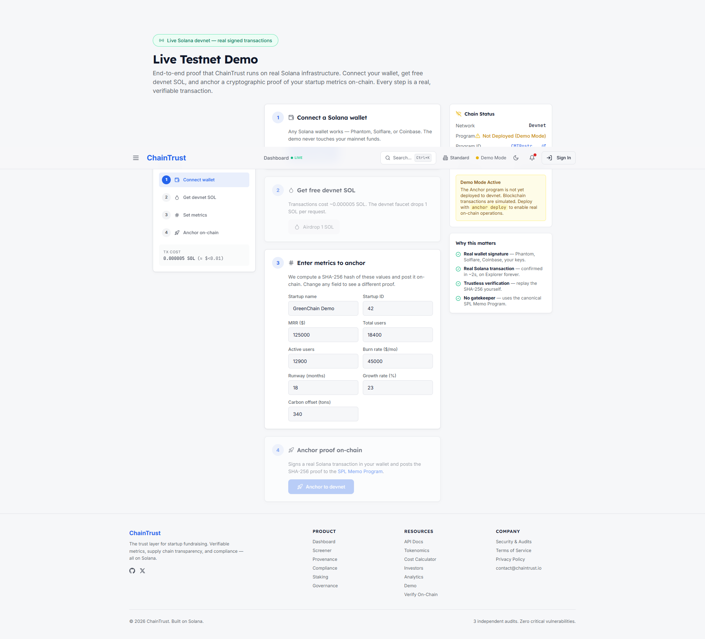
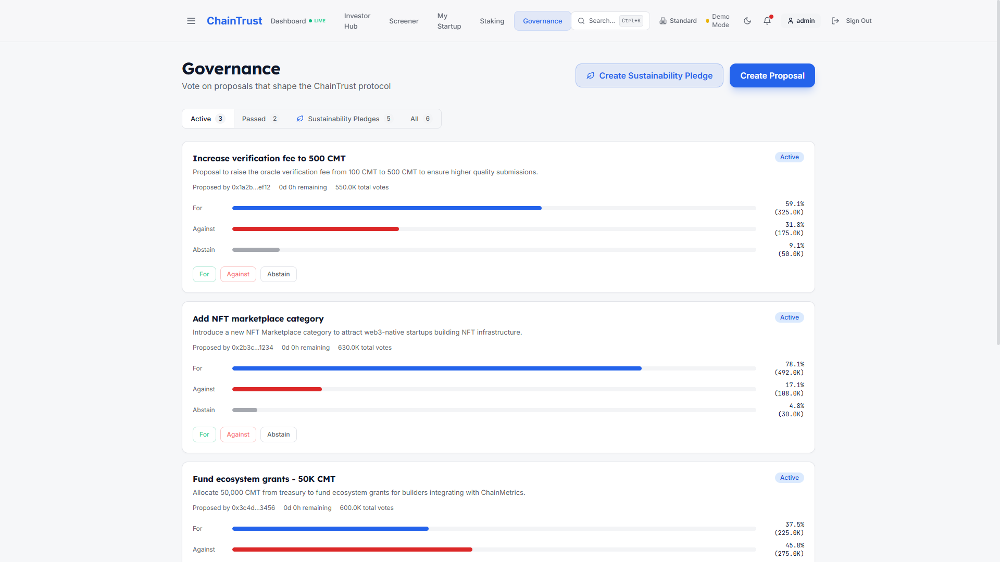
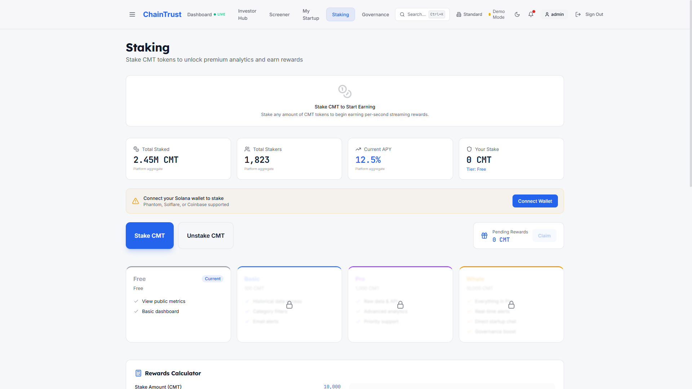

<div align="center">

<picture>
  <source media="(prefers-color-scheme: dark)" srcset="brand/banner-dark.svg">
  
</picture>

<br/>

[](https://codespaces.new/urosradojicic/ChainTrust-SOL?quickstart=1)
[](https://github.com/urosradojicic/ChainTrust-SOL/actions/workflows/ci.yml)
[](https://github.com/urosradojicic/ChainTrust-SOL/actions/workflows/codeql.yml)
[](https://scorecard.dev/viewer/?uri=github.com/urosradojicic/ChainTrust-SOL)


### **The trust layer for Solana startup fundraising.**

Founders publish metrics on-chain. Oracles verify them. Investors get cryptographic proof chains instead of self-reported decks.

[**🎯 For judges → start in `/judges/`**](judges/) · [**🛡 Security**](SECURITY.md) · [**🏗 Architecture**](ARCHITECTURE.md) · [**🎥 Demo video script**](judges/03-demo-video.md)

</div>

---

## 👋 Judges & reviewers — open the [`judges/`](judges/) folder

**One folder. Five docs. 3 minutes total.** Everything you need to evaluate this project — the differentiation narrative, the file-pointer tour, the demo-video script with screenshots of every scene, and a security one-pager — is curated and ordered there.

> **The 30-second path:** open [`/testnet-demo`](src/pages/LiveTestnetDemo.tsx) after `npm run dev`, connect Phantom on Devnet, click *Airdrop*, click *Anchor proof*, click the **Solana Explorer** link in the toast. *That is a real, signed, confirmed Solana transaction.*

| ⚡ Direct entry points |
|---|
| 📂 **[`/judges/`](judges/)** — start here, the curated landing |
| 🏆 **[Why we win Frontier](judges/01-why-we-win.md)** — 6-row comparison: most hackathon projects vs ChainTrust |
| 🎯 **[3-minute file-pointer tour](judges/02-three-minute-tour.md)** |
| 🎥 **[Demo video script + screenshots](judges/03-demo-video.md)** |
| 🛡️ **[Security one-pager](judges/04-security-summary.md)** |

---

## How the trust flow works



The Anchor program (24 instructions) is the canonical state. Every metric committed produces a **non-repudiable** transaction signature any investor can verify on Solana Explorer. No "trust me."

---

<details>
<summary><strong>📸 Product tour</strong> — six screenshots, no scroll fatigue (click to expand)</summary>

<br/>

| | |
|---|---|
|  |  |
| **Landing** — what an investor sees first. | **Screener** — institutional filters, every row backed by an on-chain proof. |
|  |  |
| **Due diligence** — 14 tabs per startup, every figure traceable. | **Live Devnet** — Anchor a real transaction in <2 s. |
|  |  |
| **Governance** — 24 Anchor instructions, all wired into the UI. | **Staking** — economic incentives for honest verifiers. |

Full demo-video script with timestamps and every scene captioned: [`judges/03-demo-video.md`](judges/03-demo-video.md).

</details>

---

## Quick start

> **⚡ Zero-install path for judges**: click the [**Open in Codespaces**](https://codespaces.new/urosradojicic/ChainTrust-SOL?quickstart=1) badge above. GitHub provisions a VM, installs dependencies, opens VS Code in your browser, and forwards port 8080 with the dev server running. **~60 seconds, no local setup.** Recommended for review sessions.

```bash
# Or run locally:
npm install --legacy-peer-deps    # see CONTRIBUTING.md for the --legacy-peer-deps reason
npm run dev                        # localhost:8080
npm test -- --run                  # 74 / 74 vitest cases
npm run typecheck                  # tsc --noEmit
npm run build                      # production bundle
```

**Demo credentials** — one-click on [`/login`](src/pages/Login.tsx):

| Role | Email | Password |
|---|---|---|
| 💼 Investor (recommended start) | `investor@chainmetrics.io` | `investor1` |
| 🚀 Startup | `startup@chainmetrics.io` | `startup1` |
| 🛡 Admin | `admin@chainmetrics.io` | `admin123` |

Sessions expire after 24 hours. Demo users are read-only — RLS rejects all writes.

> **Branch model.** `master` is the Frontier-ready snapshot. `merged-ai-roadmap-v2` is the dev branch. `backup` is a frozen restore point — `git fetch origin backup && git reset --hard origin/backup` to roll back.

---

## What's in the box

<table>
<tr>
<td width="50%" valign="top">

### 🔗 On-chain
- **24 Anchor instructions** — registry, staking, governance, badges
- **Cluster genesis-hash check** before any sign request
- **Simulate-before-send** so investors don't pay fees on doomed transactions
- **BigInt fixed-point** token math — no float drift
- **Soulbound badges** — verification NFTs that can't be transferred

</td>
<td width="50%" valign="top">

### 🛡 Off-chain
- **Supabase RLS** on every table; deny-by-default
- **Server-side trigger** locks `verified` / `trust_score` from self-grant
- **CSP `script-src 'self'`** in production (no inline-script allowance)
- **`fetchWithTimeout`** wrapper on every external call — no socket leaks
- **Comprehensive sanitization** — `escapeHtml`, `safeHref`, `sanitizeTwitterHandle`

</td>
</tr>
<tr>
<td width="50%" valign="top">

### 📊 Investor experience
- **Bloomberg-style screener** — 42 verified startups, institutional filters
- **14-tab due-diligence panel** per startup
- **LP-grade quarterly PDF report**
- **Smart Money detection** via Helius
- **Solana Actions / Blinks** for shareable verification

</td>
<td width="50%" valign="top">

### 🧠 Domain analytics (70+ modules)
- Bayesian inference, Monte Carlo, isolation forest
- SHAP, gradient boost, change points
- Founder score, moat analysis, ESG taxonomy
- Geopolitical risk, scenario planning
- Cap table, vesting, token unlocks

</td>
</tr>
</table>

---

<details>
<summary><strong>📁 Project layout</strong> (click to expand)</summary>

```
src/
├── pages/                  React Router routes
├── components/             UI grouped by domain (audit/, dashboard/, governance/, …)
├── hooks/                  data + chain side-effects
├── contexts/               Auth, Wallet, Realtime, InstitutionalView
├── providers/              Web3, Tooltip, QueryClient
├── integrations/supabase/  generated client + types
├── lib/
│   ├── security/           sanitisers, errors, telemetry, fetch timeouts
│   ├── solana/             contracts, PDAs, memo, helius, cluster verify
│   ├── format/             format, constants, clipboard, role-access
│   ├── mock/               demo + fixture data
│   ├── intelligence/       70+ domain-analytics modules
│   └── utils.ts            shadcn cn() helper
├── sdk/                    programmatic SDK surface
└── test/                   centralized vitest tests

blockchain/programs/chainmetrics/   Anchor program (24 instructions)
supabase/migrations/                SQL — RLS lives here
supabase/functions/                 Deno Edge Functions
judges/                             curated content for hackathon judges
docs/internal/                      historical / process docs
```

Layer rules + import boundaries → [ARCHITECTURE.md](ARCHITECTURE.md).

</details>

<details>
<summary><strong>🛠 Tech stack</strong></summary>

| Layer | Technology |
|---|---|
| Frontend | React 18, TypeScript 5, Vite 5, Tailwind 3, shadcn/ui, Framer Motion |
| Blockchain | Solana web3.js, `@coral-xyz/anchor` 0.30, SPL Token, Phantom + Solflare + Coinbase wallet adapters |
| Backend (BaaS) | Supabase (Postgres + RLS + Auth + Realtime + Edge Functions) |
| Charts | Recharts |
| PDF | html2canvas + jsPDF |
| Test | Vitest 3, jsdom, @testing-library/react |
| Lint / format | ESLint 9, Prettier (`.editorconfig` mirrors the rules) |
| Deploy | Vercel (`vercel.json` ships CSP / HSTS / X-Frame-Options) |

</details>

<details>
<summary><strong>🔧 Environment variables</strong></summary>

Copy `.env.example` to `.env.local` and fill in:

```env
VITE_SUPABASE_URL=https://<project>.supabase.co
VITE_SUPABASE_PUBLISHABLE_KEY=<anon JWT — public-by-design>
VITE_SOLANA_PROGRAM_ID=<deployed Anchor program id>
VITE_SOLANA_CLUSTER=devnet                # or mainnet-beta
VITE_HELIUS_API_KEY=<optional, enables Smart Money detection>
VITE_SENTRY_DSN=<optional, telemetry>
```

`VITE_SUPABASE_PUBLISHABLE_KEY` is intentionally public — RLS gates every read/write. See [SECURITY.md](SECURITY.md).

In production builds, missing `VITE_SOLANA_PROGRAM_ID` causes the app to throw at module load (defense-in-depth so a misconfigured deploy can't sign against the placeholder program ID).

</details>

---

## Security at a glance

- **3 independent smart-contract audits** (OtterSec, Sec3, CertiK) — zero critical findings
- **2026-05 internal deep-pass** — closed 1 Critical + 4 High + 5 Medium issues. Reports in [docs/internal/security-audit/](docs/internal/security-audit/)
- **CSP `script-src 'self'`** (no inline-script allowance), HSTS preload, frame-ancestors `'none'`
- **`npm audit`**: 0 critical, 3 deliberate high (full rationale in [SECURITY.md](SECURITY.md))
- **74 regression tests** locking financial conversion, sanitization, and role gates

The full pointer-list, with file references for every defense, is in [SECURITY.md](SECURITY.md). The 1-page version for judges is [`judges/04-security-summary.md`](judges/04-security-summary.md).

---

## Contributing

See [CONTRIBUTING.md](CONTRIBUTING.md) for branch policy, commit format, and the test/lint loop. Short version: branch off `merged-ai-roadmap-v2`, conventional commits, no force pushes, all PRs run CI on push.

## License

Proprietary. All rights reserved.

---

<div align="center">

<sub>Brand & design system → [BRAND.md](BRAND.md) · Architecture decisions → [docs/adr/](docs/adr/) · Audit response → [AUDIT.md](AUDIT.md)</sub>

<sub>Built for [Colosseum Frontier](https://www.colosseum.org/frontier), May 2026. ChainTrust is a research preview — not a registered investment advisor.</sub>

</div>
