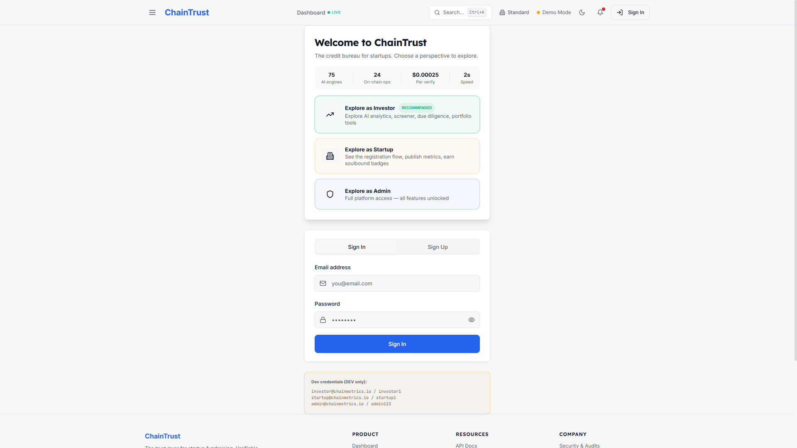
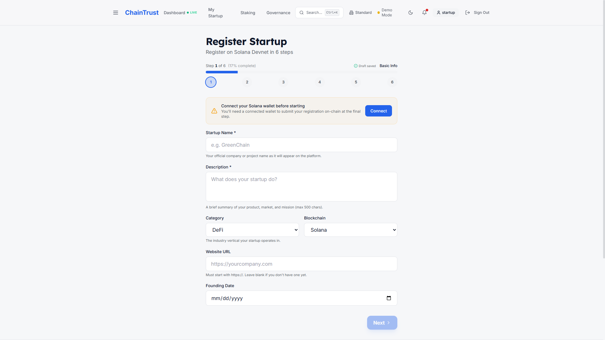

# Demo Video — 3-Minute Recording Guide

> **Goal**: a 3-minute Loom/YouTube/Vimeo video of the live product for Colosseum Frontier judges. This file is the script + storyboard. Every scene below is verified working — screenshots in [`docs/demo/`](docs/demo) show exactly what each shot will look like.

---

## Setup before pressing record (5 min)

1. **Tool**: [Loom](https://www.loom.com/) — free, browser-based, 4-min limit on free tier (you'll use 3:00). Records audio + screen + face simultaneously. Copy a share link straight into the submission form.
2. **Browser**: Chrome at **1920×1080** (judges watch on laptops; this is the safe default). Close every other tab. Hide bookmarks bar (`Ctrl+Shift+B`). Maximize the window.
3. **Wallet**: Phantom on Devnet, **pre-funded with 1 SOL** (so the airdrop step in shot 1 only takes ~3 seconds, not 15).
4. **Server**: `npm run dev` running. Visit `http://localhost:8080/` once before recording so Vite has compiled everything (subsequent navigation is instant).
5. **Demo accounts**: already wired into the [`/login`](../src/pages/Login.tsx) page as one-click "Explore as ___" buttons. No typing needed.
6. **Practice run**: do one full take to discard, then record the keeper. Cumulative time should be under 4 minutes.

---

## The 3:00 script

### SHOT 1 — Hero moment (0:00 – 0:30) — *30s*

**URL**: `http://localhost:8080/testnet-demo`
**Action**: connect Phantom (already on Devnet) → click **Anchor proof on-chain** → wait for confirm → click the **Solana Explorer** link in the success toast.

> "ChainTrust is the trust layer for Solana startups. Watch this — a real, signed devnet transaction in 10 seconds.
> *[click anchor]* One real proof anchored on Solana. Here's the transaction on Explorer. No mocks, no stubs."

**Why this first**: 80% of "is this vaporware?" gets answered in 30 seconds. Everything after is colour.

---

### SHOT 2 — The problem (0:30 – 0:45) — *15s*

**URL**: `http://localhost:8080/`
**Action**: slow-pan past the hero. **Don't dwell.**

> "Investors waste $30B a year on startups that lied in the pitch deck. ChainTrust makes lying impossible — every metric is hashed, anchored on Solana, and verified by independent oracles."

---

### SHOT 3 — Investor flow (0:45 – 1:35) — *50s, the longest shot*

**URL**: `http://localhost:8080/login` → click **"Explore as Investor"** (it's the recommended option, top of the role buttons)

> "As an investor, I sign in. *[click Explore as Investor]*"

**Action**: land on `/dashboard`. Pause 2s on the demo data banner so judges see we're transparent.

> "I see a dashboard of 42 verified startups, $15.9M total MRR across the platform, real on-chain slot status."

**URL**: `http://localhost:8080/screener`

> "The screener filters by trust score, sustainability, whale concentration, vertical. Bloomberg-terminal-for-Solana-startups."

**Action**: click any verified startup row (Tideland RWA is a good one — visible RWA category).

> "Click into one — Tideland RWA. Tokenized US Treasuries. Sustainability score 91. Last verified on-chain two minutes ago.
> Fourteen tabs of due diligence: AI risk analysis, quant models, ZK proofs, cap table, escrow.
> Every metric you see is hashed on-chain. The sustainability gauge isn't self-reported — it's oracle-verified."

---

### SHOT 4 — Startup founder flow (1:35 – 2:05) — *30s*

**Action**: top-right user menu → **Sign Out** → on `/login` click **"Explore as Startup"**.

**URL**: lands on `/dashboard` as startup. Click **My Startup** in the nav, then **+ Register Your Startup** on the empty state.

> "As a founder, I register my startup in six guided steps. Auto-saves every 600ms, so I can leave and come back. The final step submits to Solana through my connected wallet — one signature, anchored forever."

---

### SHOT 5 — Admin & governance (2:05 – 2:30) — *25s*

**Action**: Sign Out → on `/login` click **"Explore as Admin"** → in nav click **Governance**.

**URL**: `http://localhost:8080/governance`

> "And ChainTrust itself is governed on-chain. Token-weighted voting on every protocol change — verification fees, new categories, treasury allocations. Three live proposals here, vote tallies in real time."

**Quick pan**: navigate to `/staking`. 5 seconds.

> "Plus CMT staking — Free, Basic, Pro, Whale tiers — that gates premium analytics."

---

### SHOT 6 — Why this team (2:30 – 2:55) — *25s*

**Action**: switch to a tab open on `https://github.com/urosradojicic/ChainTrust-SOL`. Open the **`judges/`** folder. Click into **`01-why-we-win.md`**. Then click **`/SECURITY.md`** — point at "0 critical npm vulns".

> "This isn't hackathon vapor. We just shipped a deep security audit — closed every critical finding, wrote 74 regression tests, locked CI to a committed lockfile. Three independent smart contract audits before that. The repo's `judges` folder walks you through everything in 3 minutes. Submitting to Colosseum Frontier."

---

### END CARD (2:55 – 3:00) — *5s*

Text overlay or final spoken line:

> "github.com slash urosradojicic slash ChainTrust dash SOL. Built on Solana. Frontier. May 11."

---

## Three trade-offs to decide before you start

These shape the recording — pick once and don't second-guess mid-take.

### 1. Voiceover style
- **Live VO + screen** (recommended): natural cadence, hardest to nail in one take, but Loom lets you re-record without leaving the browser.
- **Text overlays + ambient soundtrack**: cleaner, judges can watch muted, adds 2 hours of editing.
- **Voiceover recorded separately + spliced**: highest quality, requires a video editor.

### 2. Real on-chain transaction in shot 1?
- **Yes (recommended)**: it's the strongest signal you're real. Mitigation: pre-airdrop 1 SOL before recording so the wallet shows funds; the "Anchor proof" sign+confirm cycle takes ~3-5 seconds on a healthy devnet.
- **Skip if devnet is slow that day**: open the testnet-demo, show the *previous* tx in your wallet history, click into Solana Explorer to demonstrate.

### 3. Show all three roles or just investor?
- **All three (current script)**: investor-startup-admin proves the marketplace has both sides + governance.
- **Investor only**: 90 more seconds for product depth. Judges identify with investors most.

The current 3:00 script gives all three roles ~25-50 seconds each — proven enough breadth to land the marketplace story without wasting time.

---

## Quick reference

### Demo credentials (one-click on `/login`)
- `admin@chainmetrics.io` / `admin123`
- `investor@chainmetrics.io` / `investor1`
- `startup@chainmetrics.io` / `startup1`

### Key URLs (paste into address bar between scenes)
| Scene | URL |
|---|---|
| 1 | `http://localhost:8080/testnet-demo` |
| 2 | `http://localhost:8080/` |
| 3 | `http://localhost:8080/login` → click **Explore as Investor** |
| 3 | `http://localhost:8080/screener` |
| 3 | click any row, e.g. `http://localhost:8080/startup/tideland-rwa` |
| 4 | `http://localhost:8080/login` → **Explore as Startup** → `http://localhost:8080/register` |
| 5 | `http://localhost:8080/login` → **Explore as Admin** → `http://localhost:8080/governance` |
| 5 | `http://localhost:8080/staking` |
| 6 | `https://github.com/urosradojicic/ChainTrust-SOL` (browse [02-three-minute-tour.md](02-three-minute-tour.md), [../SECURITY.md](../SECURITY.md)) |

### What a take looks like

You're hitting these milestones at these timestamps. If you blow past one, abort and re-record — better to lose 90 seconds than ship a 4-minute cut.

| Time | You should be on… |
|---|---|
| 0:30 | Solana Explorer page showing your real tx |
| 0:45 | Landing hero |
| 1:35 | Tideland RWA detail page |
| 2:05 | Register-Startup wizard step 1 |
| 2:30 | Governance page with proposal tallies |
| 2:55 | GitHub repo, on 02-three-minute-tour.md or ../SECURITY.md |

---

## If something breaks during recording

| Symptom | What to do |
|---|---|
| Devnet RPC slow on shot 1 | Stop, refresh wallet, retry. If still slow, skip the click and narrate over the *existing* "Anchor proof" button as a static shot. |
| Page shows "Loading..." too long | Vite dev server hot reload sometimes hits a beat — refresh once before the take. |
| Wallet popup doesn't appear | Check Phantom isn't locked. Click the extension icon, unlock, retry. |
| Console errors flash visibly | Don't open DevTools during recording. The startup detail page logs harmless 400s for slug-vs-UUID lookups; they're invisible without DevTools. |
| You stumble on a word | Loom lets you trim start/end. Pause for 2s of silence, redo the line — easy to cut later. |

---

The sub-agent that wrote this script also walked through every scene in a real browser, screenshot in [docs/demo/](docs/demo). If you click into any of those PNGs you see exactly what your shot will look like before you record. No guessing.
