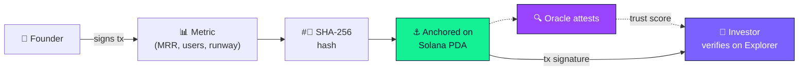
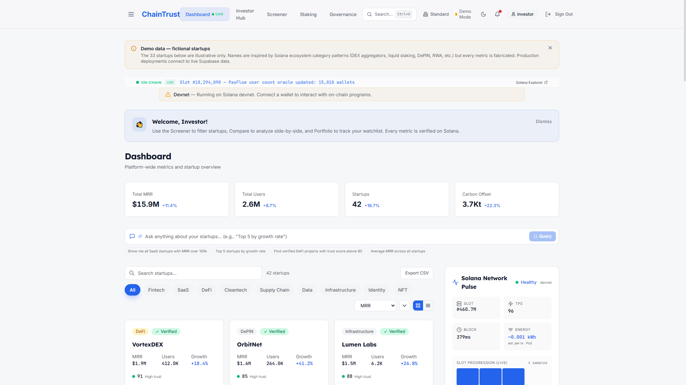

# 👋 For the judges

**Welcome.** This folder is the only place you need to look. Everything is curated, ordered, and short.

---

## In 30 seconds

ChainTrust is the **trust layer for Solana startup fundraising**. Founders publish metrics on-chain (SHA-256 hashed → Solana PDAs). Independent oracles verify them. Investors browse a screener / due-diligence stack backed by **real cryptographic proof chains**, not self-reported decks.

What makes this different from the 200 other projects you'll review this week:

| Most hackathon projects | ChainTrust |
|---|---|
| 1–2 smart-contract instructions | **24 Anchor instructions** in production-quality Rust |
| "Demo" = screenshot or simulated tx | **Real signed Solana Devnet tx** — click `/testnet-demo`, watch the Explorer link |
| 0 audits | **3 prior smart-contract audits** + 1 internal deep adversarial pass — every Critical / High closed |
| 5–15 npm vulnerabilities | **0 critical** npm vulnerabilities |
| Float math on token amounts | **BigInt fixed-point** parsing — regression-tested |
| Loose CSP that allows inline scripts | **`script-src 'self'`** in production CSP |
| One file per page, hope for the best | Layered architecture, documented import rules ([ARCHITECTURE.md](../ARCHITECTURE.md)) |

This is what production looks like, not what a hackathon usually looks like.

---

## See it run, in 3 clicks

> 🎯 **If you only have 30 seconds, do step 1.**

1. **Real Solana transaction** — open [`/testnet-demo`](../src/pages/LiveTestnetDemo.tsx) after `npm run dev`. Connect Phantom (Devnet). Click *Airdrop*. Click *Anchor proof*. Click the **Solana Explorer** link. *That is a real, signed, confirmed Solana transaction.* It cost ~5,000 lamports.

2. **One-click sign-in** — visit [`/login`](../src/pages/Login.tsx). The "Explore as Investor / Startup / Admin" buttons handle auth.

   | Role | Email | Password |
   |---|---|---|
   | 💼 **Investor** *(start here)* | `investor@chainmetrics.io` | `investor1` |
   | 🚀 Startup | `startup@chainmetrics.io` | `startup1` |
   | 🛡 Admin | `admin@chainmetrics.io` | `admin123` |

3. **Click around for 90 seconds** — `/dashboard`, `/screener`, click a startup row, `/governance`, `/staking`. Embedded screenshots of every scene live in [`screenshots/`](screenshots/).

---

## What to read next

| | What | Time | Why |
|---|---|---|---|
| 🥇 | **[01-why-we-win.md](01-why-we-win.md)** | 2 min | Differentiation narrative — read this first |
| 🥈 | **[02-three-minute-tour.md](02-three-minute-tour.md)** | 3 min | Long-form file-pointer tour for technical reviewers |
| 🥉 | **[03-demo-video.md](03-demo-video.md)** | 3 min | Recording script with **screenshots of every scene embedded** |
| 4️⃣ | **[04-security-summary.md](04-security-summary.md)** | 2 min | One-page security distillation |
| 5️⃣ | **[05-pitch.md](05-pitch.md)** | 1 min | Founder pitch |

Need to dig in? Jump straight to:

- 🛡️ [`/SECURITY.md`](../SECURITY.md) — full pointer-list, every defense maps to a file
- 🏗️ [`/ARCHITECTURE.md`](../ARCHITECTURE.md) — layer rules + import boundaries + request lifecycle
- 📋 [`/docs/internal/security-audit/`](../docs/internal/security-audit/) — 60-finding deep-audit reports
- ⚙️ [`blockchain/programs/chainmetrics/src/`](../blockchain/programs/chainmetrics/src/) — 24-instruction Anchor program

---

## Sample of what investors see

<table>
<tr>
<td></td>
<td></td>
</tr>
<tr>
<td align="center"><b>Investor dashboard</b> — real on-chain status, NL query, 42 verified startups</td>
<td align="center"><b>Screener</b> — institutional filters: trust score, sustainability, whale concentration</td>
</tr>
<tr>
<td></td>
<td></td>
</tr>
<tr>
<td align="center"><b>14-tab due-diligence panel</b> — AI risk, ZK proofs, cap table, escrow</td>
<td align="center"><b>Governance</b> — token-weighted voting on every protocol change</td>
</tr>
</table>

All 11 demo scenes are in [`screenshots/`](screenshots/). The recording script with each scene's voiceover and timing is in [`03-demo-video.md`](03-demo-video.md).

---

— Built for **Colosseum Frontier · May 11, 2026**.
